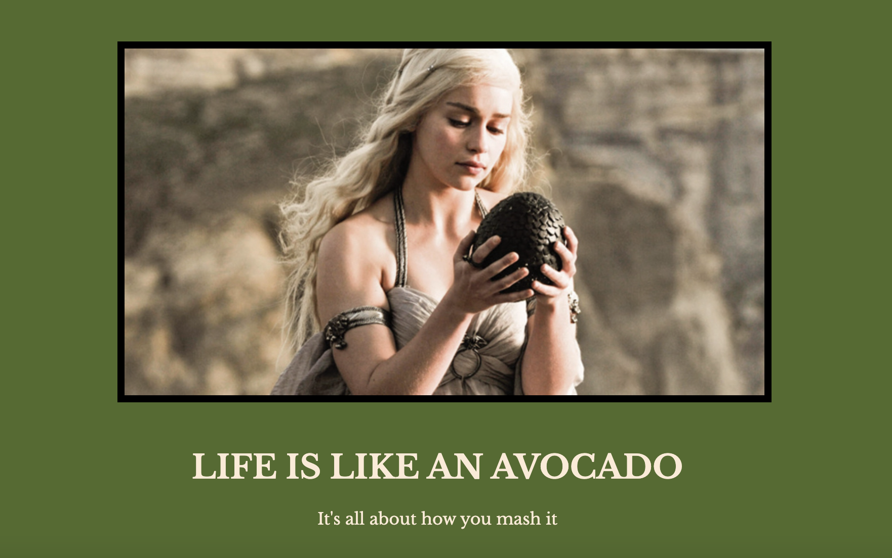

# Motivational-Post-Website

## Live URL
https://samamiraa.github.io/Motivational-Post-Website/

## Description

Motivational Post Website created with HTML and basic CSS styling. Starter code and materials provided by UDEMY course 2024 Complete Full Stack Web Dev course by Angela Yu. The purpose of going over this course is to solidy my understand of the knowledge I recently acquired from the Full Stack Coding Bootcamp I completed with University of New Brunswick. After completing the bootcamp, I noticed my weaker skills were styling.

## Credits

UDEMY Complete 2024 Full Stack Web Dev Course by Angela Yu  
https://github.com/angelabauer 
https://developer.mozilla.org/en-US/docs/Web/CSS/text-transform

## License

## Badges

